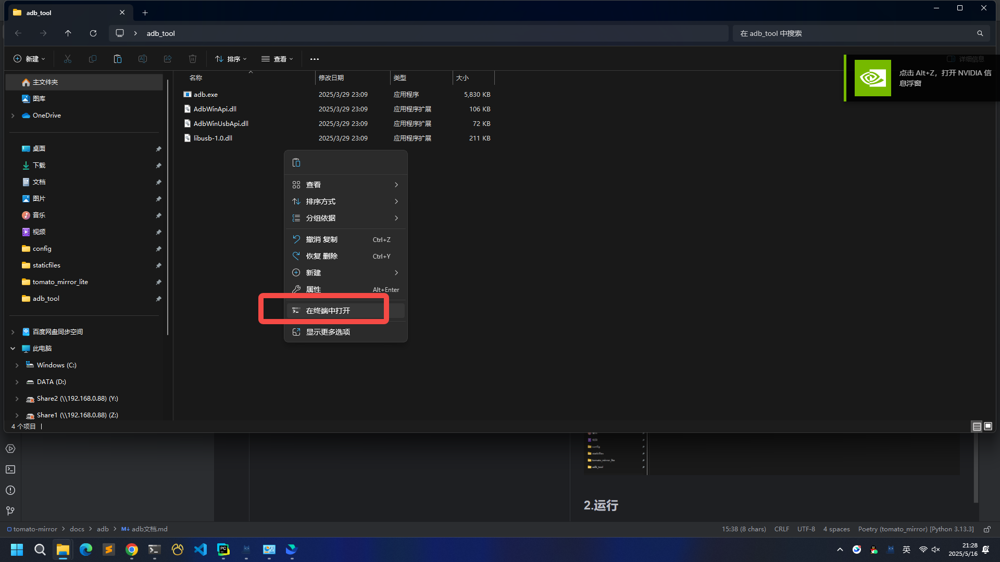
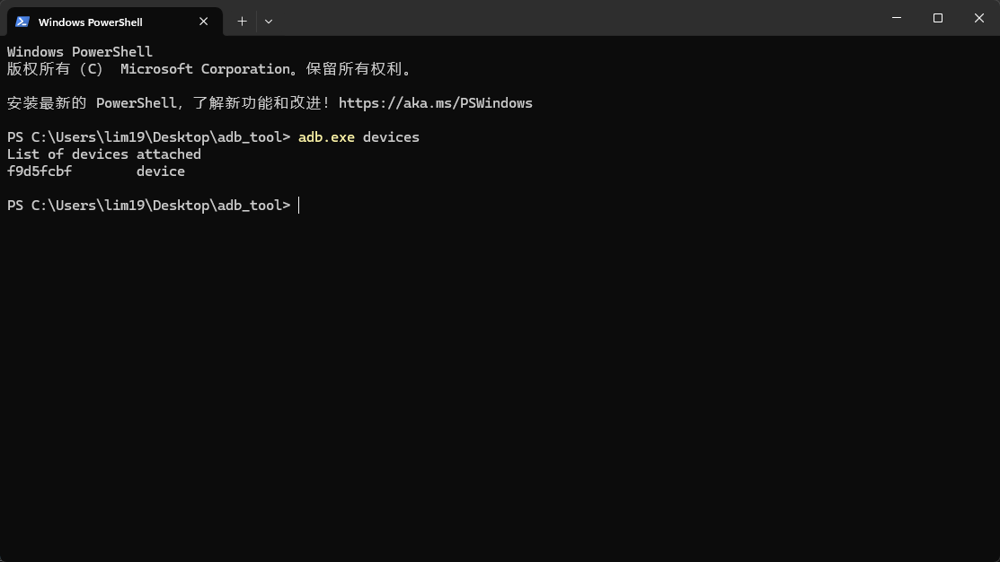

# 一.安卓手机打开adb调试

## 1.打开 *开发者选项*
> 不同型号手机打开方式不同，具体可百度。

设置->关于本机->版本信息->不停点击版本号(提示进入开发者模式)
## 2.打开 *USB调试*
> 不同型号手机打开USB调试方式不一样，比如小米必须插入sim卡才能打开调试。

重进打开设置->进入开发者选项->勾选USB调试
 

# 二.adb配置
## 1.下载
[adb_tool.zip](../../files/adb_tool.zip)，解压后进入adb_tool目录

## 2.运行
### 目录内，鼠标右键`在终端打开`，打开黑窗口

### 黑窗口执行 `adb.exe devices`,看到如下的设备列表就是配置成功！！！
