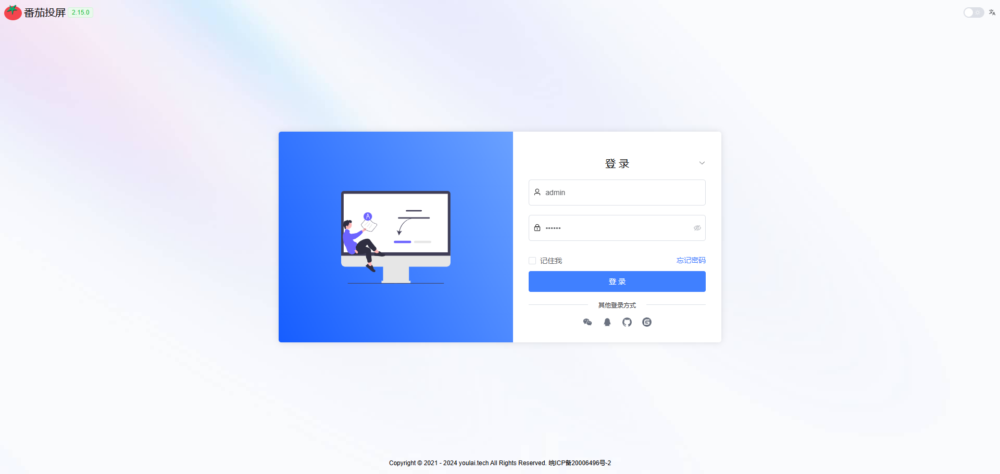
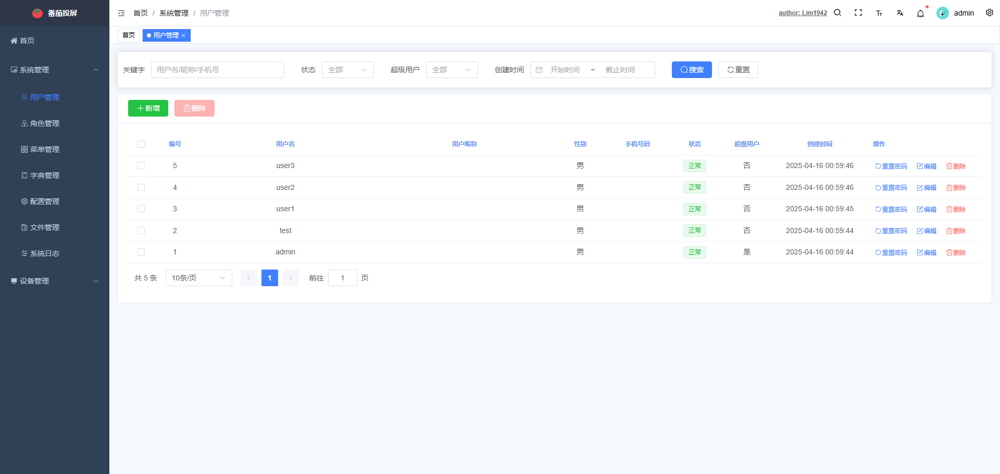
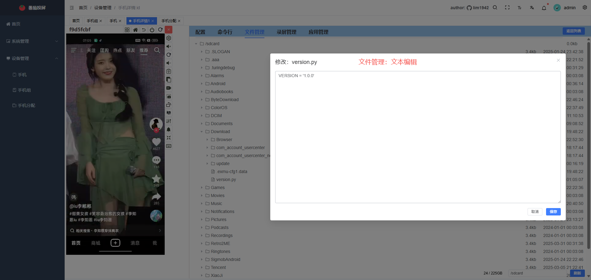
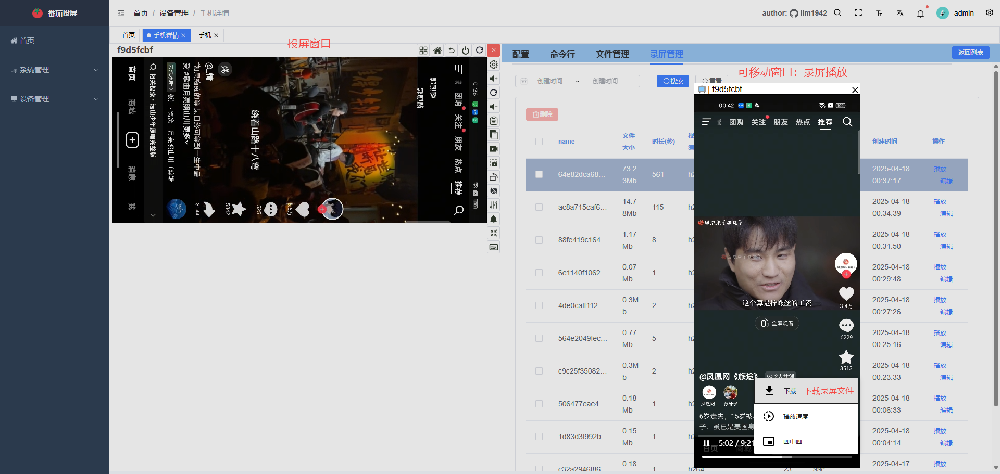

# 番茄投屏Pro
|||
|---------------------------|----------------------------------|

## 一.下载
### `请加qq交流群(957034905)联系群主`

## 二.功能截图
### 1.登录页

### 2.基础管理

### 3.视图列表页

### 4.普通列表页

### 5.详情页-配置

### 6.详情页-命令行

### 7.详情页-文件管理

### 8.详情页-录屏管理

### 9.详情页-应用管理

### 10.手机分组管理

### 11.手机分配

