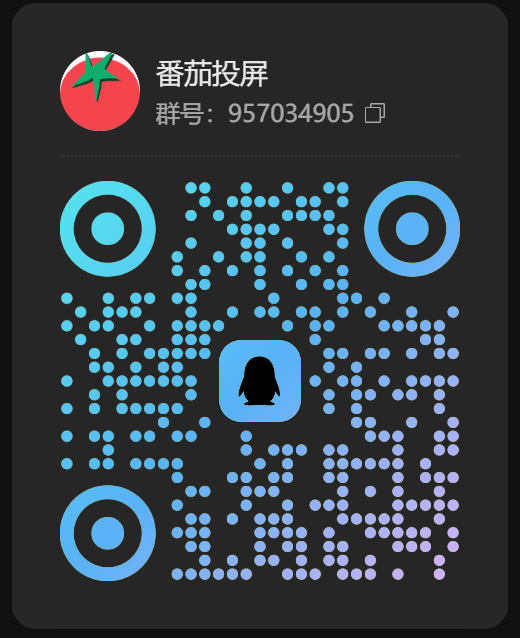
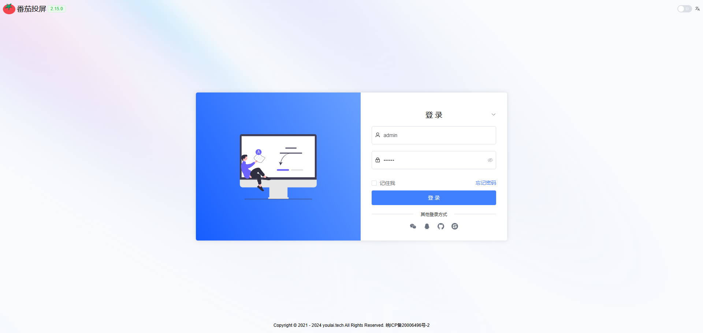
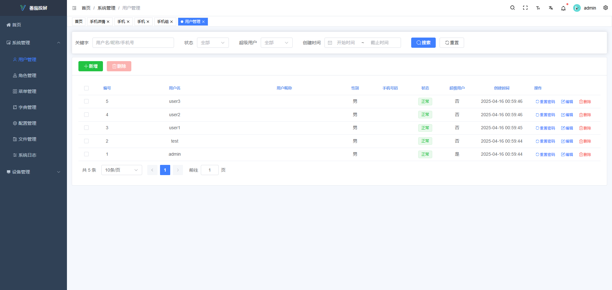
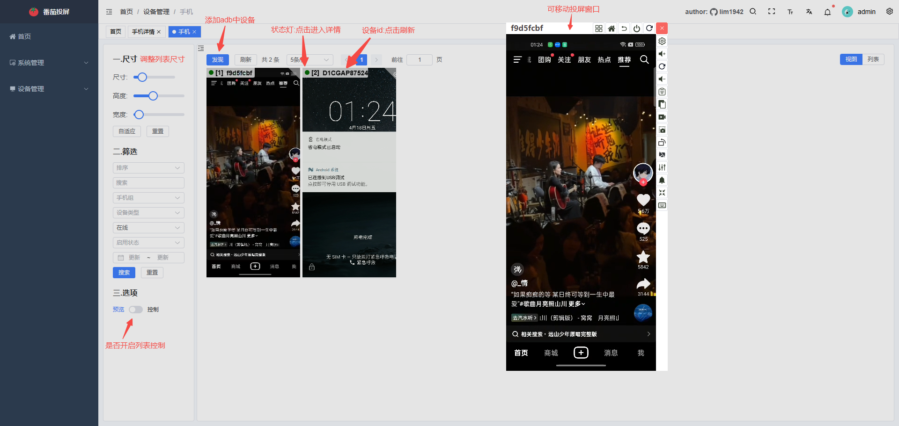
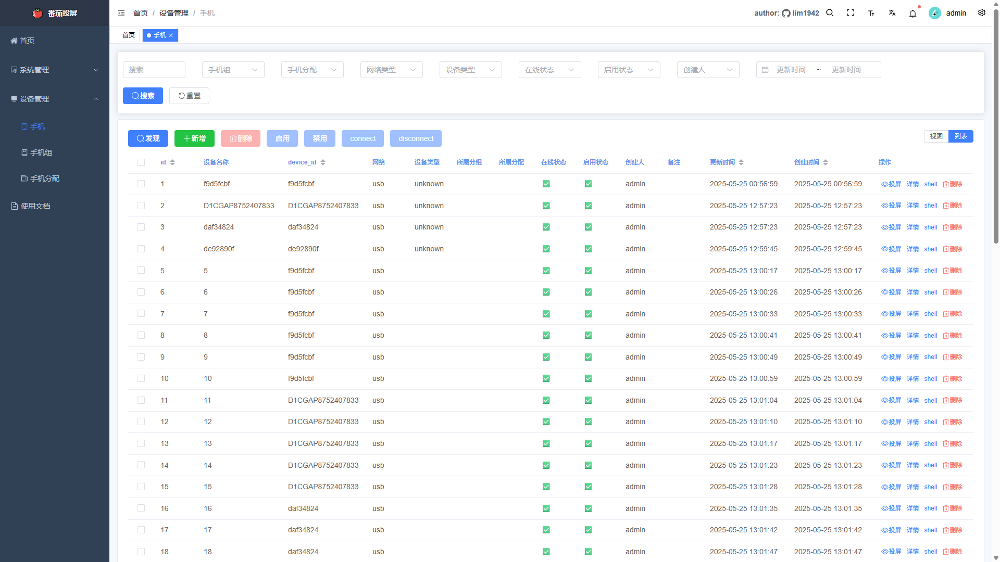
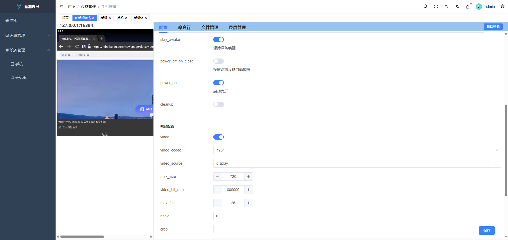
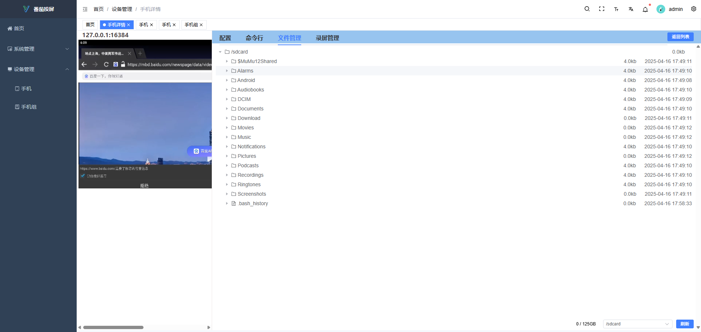
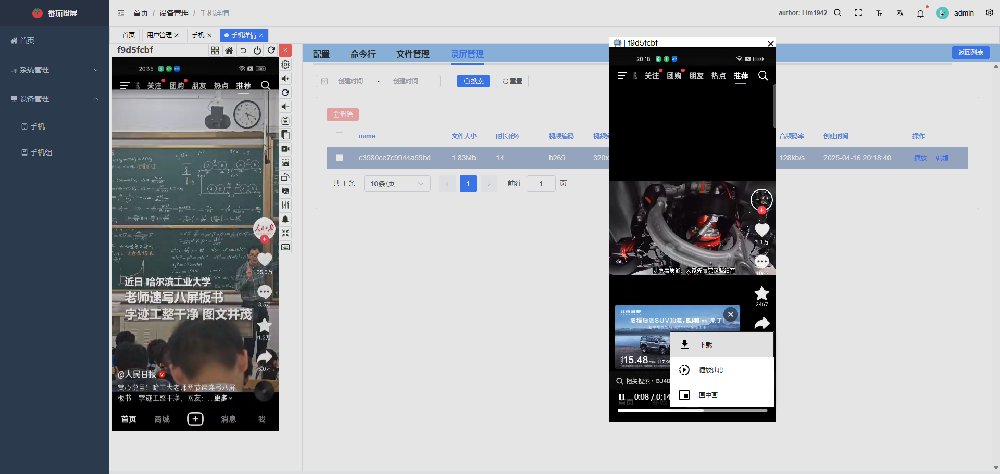
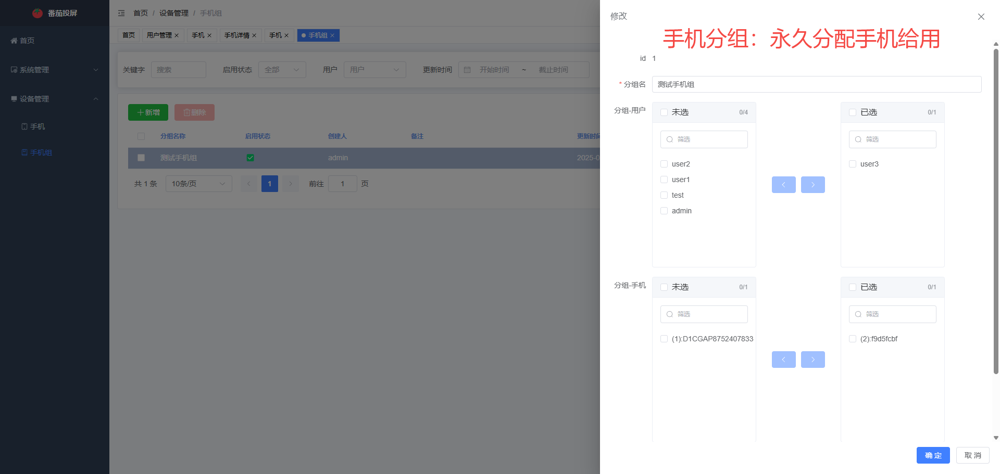
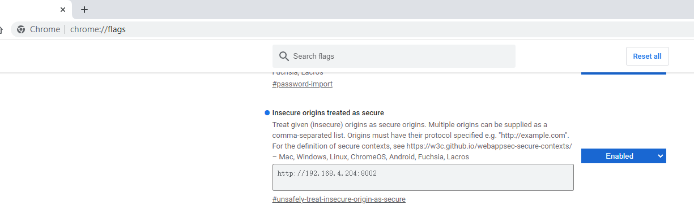

# 番茄投屏
|||
|---------------------------|----------------------------------|

  
**实现浏览器控制安卓手机，投屏延迟低至30ms。基于scrcpy3.2，主要功能如下:**
- 权限管理(可对指定用户分配设备)
- 分组管理
- 列表投屏
- 无线投屏
- 摄像头投屏
- 音频播放
- shell命令行
- 文件管理
- 录屏播放
- 键盘直连输入
- 视频`码率/编码器/帧率/尺寸`调整
- 音频`码率/编码器`调整
- ...

## 一.使用方法
>只支持windows， [点击下载](https://github.com/lim1942/tomato-mirror/releases/download/v1.0.0/tomato-mirror1.0.0.zip)

1. 确保已经配置好adb和手机，adb devices能看到手机列表
2. 下载解压软件，点击 `运行.cmd`后，谷歌浏览器访问 `http://127.0.0.1:8888/`
3. 初次使用点击 `手机` >`发现` 按钮，将自动录入adb devices中的设备。
4. 局域网/互联网无法投屏，请看下面[webcodecs](#%E4%B8%89webcodecs)的关闭浏览器安全限制。
## 二.功能截图
### 1.登录页

### 2.基础管理

### 3.投屏列表页

### 4.列表页

### 5.详情页-配置

### 6.详情页-命令行

### 7.详情页-文件管理

### 8.详情页-录屏

### 9.详情页-录屏播放

### 10.手机分组管理

## 三.webcodecs
由于浏览器安全限制，VideoDecorder, AudioDecorder需要在https或者本地localhost访问才能使用。  
### 1.chrome关闭特定网址安全限制
浏览器输入 chrome://flags

在Insecure origins treated as secure中加入需要关闭安全限制站点，逗号分隔，配置好点击Relauch.重启后该站点可用webcodecs播放器了。
