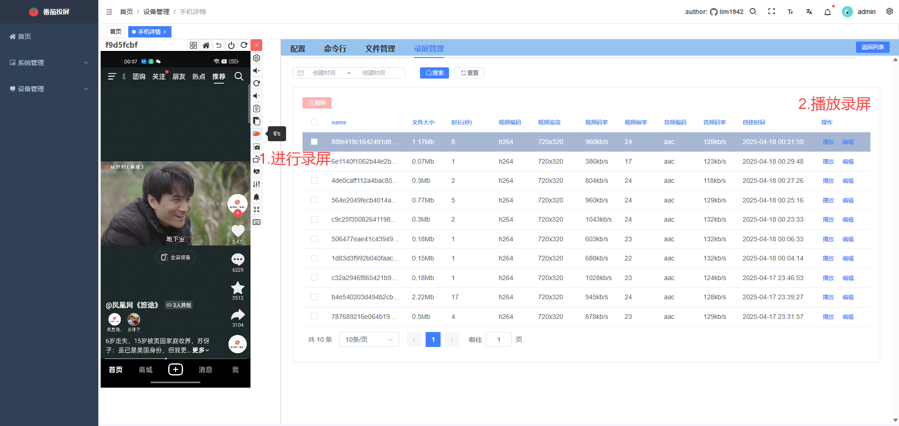

# 番茄投屏
|||
|---------------------------|----------------------------------|

  
**实现浏览器控制安卓手机，投屏延迟低至30ms。基于scrcpy3.2，主要功能如下:**
- 权限管理(基于角色权限控制：删除/增加/编辑/投屏/文件管理/shell/应用管理等权限)
- 手机分配(限时：限定给用户分配手机，到期后收回分配)
- 分组管理(不限时：将分组内的所有手机授予用户)
- 列表投屏
- 无线投屏
- 摄像头投屏
- 音频播放
- shell命令行
- 文件管理
- 应用管理
- 录屏播放
- 键盘直连输入
- 视频`码率/编码器/帧率/尺寸`调整
- 音频`码率/编码器`调整
- ...

## 一.下载&使用
**只支持windows部署**  
### 下载
- lite版本：[番茄投屏lite.exe](https://github.com/lim1942/tomato-mirror/releases/download/v1.0.0/tomato_mirror_lite1.0.1.exe)
- pro版本：敬请期待...

### 使用
1. 确保已经配置好adb和手机，adb devices能看到手机列表
2. 下载解压软件，点击 `tomato_mirror.exe`后，谷歌浏览器访问 `http://127.0.0.1:8888/`
3. 局域网/互联网若无法投屏，请看下面[webcodecs](#%E4%B8%89webcodecs)的关闭chrome浏览器安全限制。

## 二.功能截图
### 1.登录页

### 2.基础管理

### 3.视图列表页【pro版本】

### 4.普通列表页

### 5.详情页-配置

### 6.详情页-命令行【pro版本】

### 7.详情页-文件管理【pro版本】

### 8.详情页-录屏管理【pro版本】

### 9.详情页-应用管理【pro版本】

### 10.手机分组管理

### 11.手机分配【pro版本】

## 三.webcodecs
由于浏览器安全限制，VideoDecorder, AudioDecorder需要在https或者本地localhost访问才能使用。  
### 1.chrome关闭特定网址安全限制
浏览器输入 chrome://flags

在Insecure origins treated as secure中加入需要关闭安全限制站点，逗号分隔，配置好点击Relauch.重启后该站点可用webcodecs播放器了。

## 四.其他问题
### 1.环境变量
> ***计算机(右键) >属性 >高级系统设置 >环境变量***,  设置完重启软件
- ***ADB_SERVER_ADDR*** 设置adb地址，默认127.0.0.1   

- ***ADB_SERVER_PORT*** 设置adb端口，默认5037   

- ***TOMATO_SERVER_PORT*** 设置http服务端口，默认8888  
- ***TOMATO_WS_SERVER_PORT*** 设置ws服务端口，默认8082    
